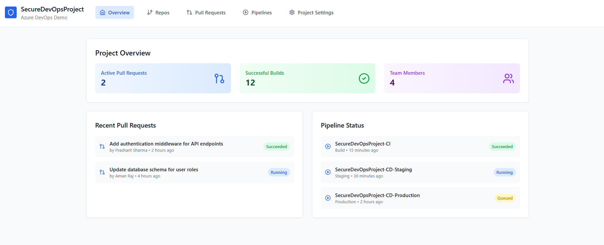

# 🔐 Azure DevOps Project: SecureDevOpsProject

This repository contains the configuration and documentation for the **SecureDevOpsProject**, developed as part of an Azure DevOps internship assignment. The goal was to implement **group policies, branch security, CI/CD pipelines, and pull request workflows** with proper role-based access control and automation.

---

## 📌 Project Overview

The following tasks were implemented in the Azure DevOps environment:

- ✅ Created a project with user groups: **Project Administrators** and **Contributors**
- ✅ Applied group policies and access controls
- ✅ Set branch policies (require PRs, review, and build validation)
- ✅ Applied branch security, filters, and locks
- ✅ Implemented pull request workflow
- ✅ Configured CI/CD pipelines with gated deployments
- ✅ Added pipeline triggers and security
- ✅ Linked work items to commits and pull requests

---

## 🚧 Branch Security & Policies

- Contributors can **create PRs only** — **cannot merge to master**
- Project Admins can review and approve PRs
- Branch filters and path filters are active
- Security and lock policies applied to `master`

---

## 🧪 CI/CD Pipeline Setup

- CI triggered on PR or push to `develop` or `feature/*`
- Release pipelines include **gates** (approvals, health checks)
- Secure access to pipeline editing

---

## 🔁 Work Items Integration

- Work items are **linked to pull requests and commits**
- Boards used for tracking tasks using Agile process

---

## 📸 Screenshots

### 🔹 Home Dashboard

## 🌐 Live Demo
You can view a live simulation/mockup of this project here:
- 🔗 https://courageous-ganache-0d2bb6.netlify.app/

## 📚 References & Resources
- Azure DevOps Docs – Add Users & Groups

- Branch Permissions

- Build Triggers

- Release Gates

- Work Items in Pipelines

Let me know once you’ve hosted the demo or taken screenshots — I can help you embed them properly!
